# BlinkAnnotator


## Bibliotecas utilizadas
Para a leitura do teclado foi utilizado o **pynput**.
Para tratamento de vídeo e algoritmos de detecção foram utilizados o **OpenCV**, **Dlib** e **tensorflow+keras**.
O **OpenCV** é a biblioteca utilizada na captura de vídeo, detecção de face, manipulação e visualização de imagens.
O **Dlib** foi utilizado para a detecção dos *facial landmarks*.
O **tensorflow** e **keras** são permitem a utilização de *redes neurais*.

Para auxiliar a interação com o usuário, a biblioteca **tqdm** foi usada a fim de inicar o progresso do usuário no script.


## *Scripts* implementados
### Grupo A
- `face_recorder.py`: Permite que o usuário grave sua face e marque (utilizando o teclado) quando seus olhos fecharam
- `avg_annotator.py`: A partir das saídas de `face_recorder.py`, calcula a media dos pixeis na região dos olhos para análise
- `points_annotator.py`: A partir das saídas de `face_recorder.py`, detecta *facial landmarks* na região dos olhos para análise

### Grupo B
- `dataset_recorder.py`: Permite que o usuário tenha sua face gravada e emite duas vezes um sinal sonoro de dois segundos, indicando que o usuário deve fechar os olhos durante esse momento
- `pre_annotator.py`: A partir das saídas de `dataset_recorder.py`, utiliza uma CNN para preanotar se as frames estão com os olhos abertos ou fechados
- `blink_annotator.py`: A partir das saídas de `pre_annotator.py`, o usuário analisa as anotações e corrige aquelas erradas
- `visualizer.py`: Visualizador de anotações de `blink_annotator.py` ou `pre_annotator.py` em vídeo

## Como usar `blink_annotator.py`
### Uso do *script*
O *script* é dividido em três fases:
- identificação de frames mal preanotadas
- correção de frames identificadas
- identificação e correção de sequências muito curtas

#### Primeira fase
Na primeira fase, o usuário irá indicar as frames que não foram classificadas corretamente. Para isso, serão criados dois grupos: os grupos de frames classificadas como OLHOS_ABERTOS e o outro grupo como OLHOS_FECHADOS.

Todas as imagens de cada grupo serão passadas em sequência e o usuário deverá indicar quando uma imagem não pertence ao determinado grupo. Será utilizada a barra de espaço para isso. Como podem haver atrasos por parte do usuário e por parte do computador, será considerada a frame atual e uma janela contendo as X últimas frames. O valor de X está em função da velocidade que as frames irão passar, essa regulada pelo usuário por argumento de entrada (`timesSlower`).

Note que uma marcação indica a frame atual e uma janela das frames passadas, mas não uma janela das frames futuras. Logo, sempre que for visto uma imagem fora da classe, a barra de espaço deve ser apertada, mesmo que essa já tenha sido poucos instantes antes.

Assim que o usuário executar o programa, a primeira fase começa e o seguinte texto é impresso:
<br>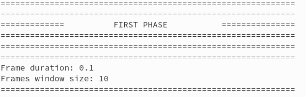

Nele, é indicado que a primeira fase está começando, e também são indicados o tempo que cada frame aparecerá (em segundos) e o tamanho da janela de frames passadas que será considerada a fim de tratar o atraso. Ambos valores, como já dito, estão em função do parâmetro de entrada `timesSlower`.

O primeiro grupo que será mostrado será o de OLHOS_FECHADOS. Logo, o usuário deve marcar com barra de espaço todas as frames que encontrar algum olho aberto.

<br>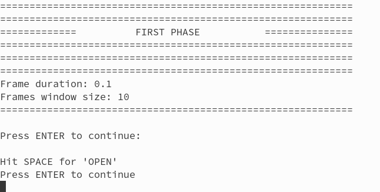

Nessa fase, o usuário deve apertar espaço em casos como o seguinte (já que esses casos **não** estão em sua classe correta)
<br>
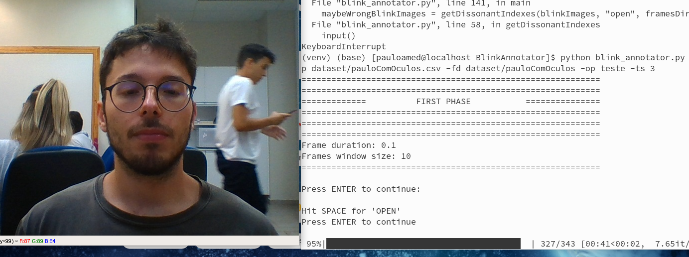

E não apertar em casos como o seguinte (já que esses casos estão em sua classe correta)
<br>
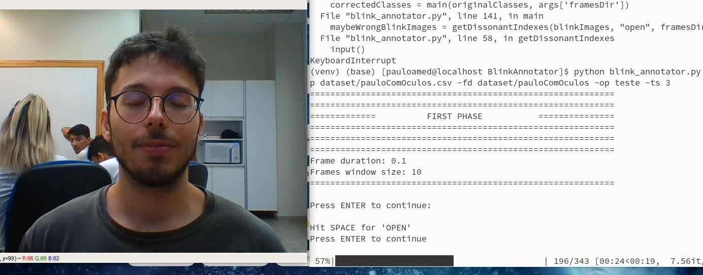

O fim dessa fase é indicado com a quantidade de frames cujas classes o usuário indicou como erradas.

#### Segunda fase
Na segunda fase, o usuário irá anotar/corrigir as frames que marcou como erradas. As frames irão aparecer na tela e esperar que o usuário indique se pertencem à classe de olhos abertos (`O`, para *open*) ou fechados (`C`, para *closed*).

<br>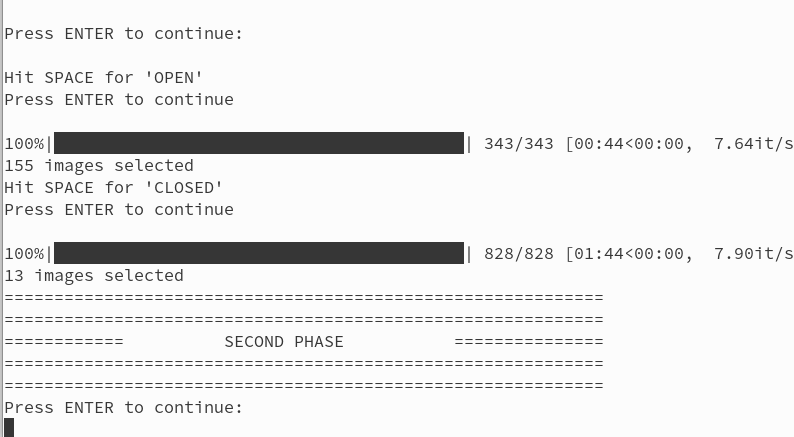
<br>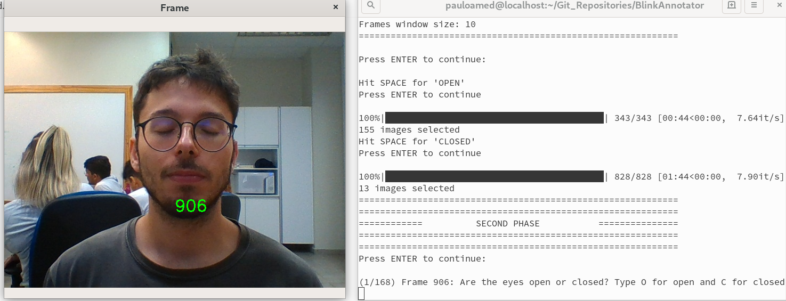

O usuário deve digitar `C` ou `O`. A digitação errada será indicada com a mensagem `Wrong input!`.

<br>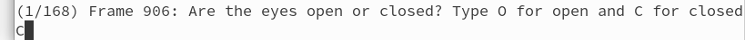
<br>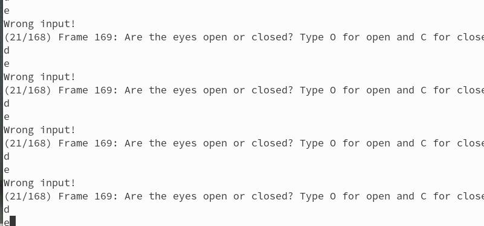
<br>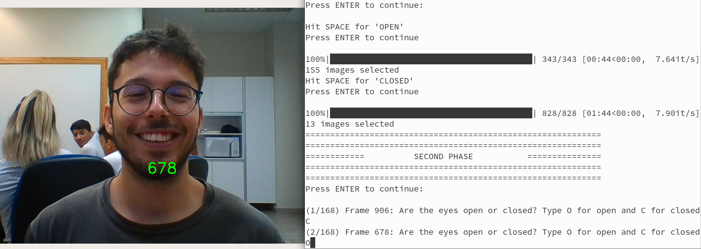

É necessária uma discussão do time de anotação para essa fase, dado que aparecerão casos não tão simples de serem anotados, como o seguinte

<br>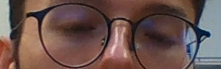

#### Terceira fase
A terceira fase irá indicar e corrigir as sequências muito curtas. O que foi classificado até agora será analisado e as sequências de tamanho abaixo de um limite indicado pelo usuário (argumento de entrada `seqThreshold`) serão salvas numa lista. As sequências adjacentes serão unidas numa só lista.

<br>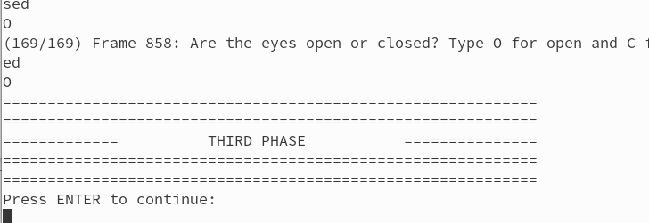

Após a extração dessas sequências, essas serão postas novamente para correção. Cada sequência será reproduzida para o usuário, para que esse possa analisá-la melhor. Se for do interesse do usuário, esse pode reproduzir novamente a sequência.

<br>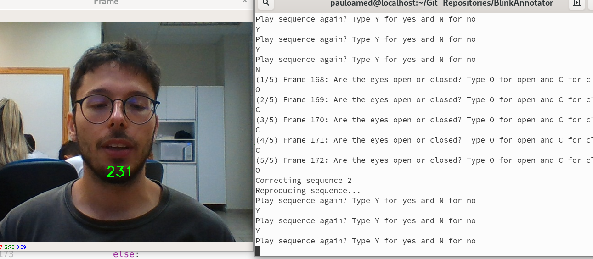

Então, a sequência será posta para anotação

<br>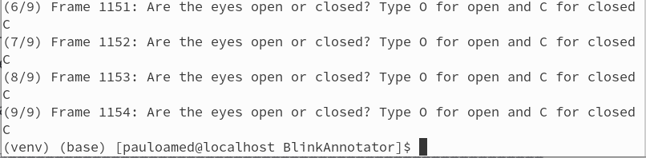

### Como instalar
Basta instalar a biblioteca as seguintes bibliotecas:
```
pip install opencv-python
pip install pynput
pip install tqdm
```

### Como executar
O script deve ser executado utilizando os seguintes argumentos:
```
-ip --inputPath: caminho para arquivo .csv com as preanotações
-fd --framesDir: caminho para diretório com frames anotadas por INPUT_PATH
-op --outputPath: caminho onde o arquivo .csv com as anotações corrigidas deve ser salvo
-ts --timesSlower: quantas vezes mais lento que a reprodução normal serão passadas as frames na primeira fase
-st --seqThreshold: limite de tamanho de sequência para a terceira fase

timesSlower é um argumento facultativo. Se não indicado, será assumido o valor 3.
seqThreshold é um argumento facultativo. Se não indicado, será assumido o valor 3.
```

Para executá-lo:
```
python face_recorder.py -ip inputPath -fd framesDir -op outputPath -ts timesSlower -st seqThreshold
```
Os argumentos facultativos não precisam ser indicados
```
python face_recorder.py -ip inputPath -fd framesDir -op outputPath
```

## Como usar Face Recorder
### Instalação
Basta instalar a biblioteca do OpenCV e do pynpuy para python:
```
pip install opencv-python
pip install pynput
```
### Execução
O script para gravador da face deve ser executado utilizando os seguintes argumentos:
```
-rp --recordsPath : Caminho será salvo arquivo pickle com as informações de cada frame
-fd --framesDir : Caminho para diretório onde serão salvas as frames
```

Para executá-lo:
```
python face_recorder.py -rp RECORDS_PATH -fd FRAMES_DIR
```

Durante a execução, aparecerá a seguinte janela como *feedback*.
<br>


O texto em verde indica por quanto tempo o programa está rodando. Ao atingir 60 segundos, o programa irá automaticamente terminar.

O texto em azul indica a situação dos olhos de acordo com o usuário. Segurar a tecla `n` indicará que o usuário está com os olhos fechados.

O texto em vermelho indica a quantas frames por segundo (`FPS`) o programa está operando.

O programa pode ser abortado teclando `q`. Isso fará com que o diretório criado com as frames já gravadas seja excluído.

## Como usar Points Annotator
TODO
