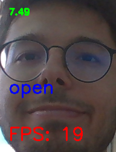
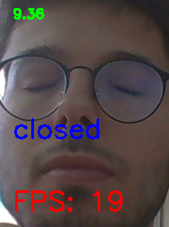

# Experiment Scripts

## Como usar Face Recorder
### Instalação
Basta instalar a biblioteca do OpenCV e do pynpuy para python:
```
pip install opencv-python
pip install pynput
```
### Execução
O script para gravador da face deve ser executado utilizando os seguintes argumentos:
```
-rp --recordsPath : Caminho será salvo arquivo pickle com as informações de cada frame
-fd --framesDir : Caminho para diretório onde serão salvas as frames
```

Para executá-lo:
```
python face_recorder.py -rp RECORDS_PATH -fd FRAMES_DIR
```

Durante a execução, aparecerá a seguinte janela como *feedback*.
<br>



O texto em verde indica por quanto tempo o programa está rodando. Ao atingir 60 segundos, o programa irá automaticamente terminar.

O texto em azul indica a situação dos olhos de acordo com o usuário. Segurar a tecla `n` indicará que o usuário está com os olhos fechados.

O texto em vermelho indica a quantas frames por segundo (`FPS`) o programa está operando.

O programa pode ser abortado teclando `q`. Isso fará com que o diretório criado com as frames já gravadas seja excluído.
